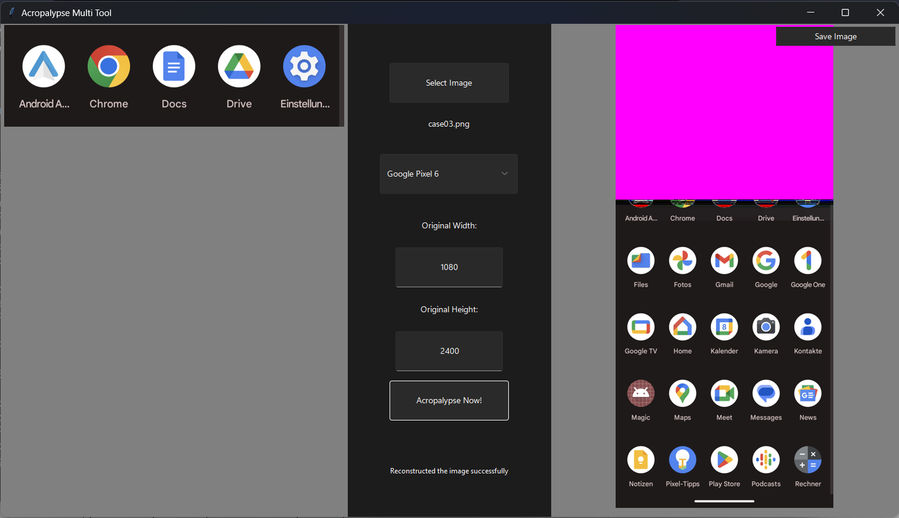

# Acropalypse Restoration and Detection Multi-Tool

### A Comprehensive Solution for Acropalypse-Affected Images

Easily restore PNG and GIF files that have fallen victim to the Acropalypse CVE from 2023. This all-in-one solution effectively recovers image data accidentially stored in cropped screenshots by Google Pixel phones or Windows Snipping Tool, and can search and detect vulnerable images within local folders.

This Tool works seamlessly with Python 3.10 cross-platform on Windows and Linux-based systems.

Also, yes this code is quite dirty, as it was created as part of a lecture at University of Applied Sciences Upper Austria, and students dont have much spare time - so deal with it 😎

**Key Features & Improvements**:
- Restore and detect both GIF and PNG formats
- Support for PNG images with and without an alpha channel (RGB and RGBA)
- Compatible with all resolutions and tools, including Snipping Tool and Pixel Markup
- Enhanced PNG data restoration for improved reference color filling

<p align="center">
  
</p>

**Based on**:
- https://gist.github.com/DavidBuchanan314/93de9d07f7fab494bcdf17c2bd6cef02
- https://github.com/heriet/acropalypse-gif

**Affected CVE´s**:
- CVE-2023-28303 https://msrc.microsoft.com/update-guide/vulnerability/CVE-2023-28303
- CVE-2023-21036 https://cve.mitre.org/cgi-bin/cvename.cgi?name=CVE-2023-21036

## Getting Started
The GUI has two main tools:

- DetectTool: This tool helps to identify the pictures that are vulnerable to the acropalypse bug in a specific folder.
- RestoreTool: This tool assists in restoring the vulnerable pictures.

Install the required Python Version and Libraries and open the Tool via Commandline with

`python ./gui.py`

You can also use the prebuilt **docker image**:

On Linux run:
```
xhost +local:
sudo docker run -e DISPLAY=$DISPLAY -v /tmp/.X11-unix:/tmp/.X11-unix frankthetankmusic/acropalypse-multi-tool
```
This docker image uses the python:3.10 container, see Dockerfile for how it is configured.

On Windows you will have to install and configure X-Server for the gui to work.

### System Compatibility

- Python 3.10 (other versions may also work)
  - update 03-2024: working with Python 3.11 on Linux Mint 21.2 Cinnamon
- Windows / Linux / WSL

### Required Libraries

Pillow==9.5.0<br>
sv_ttk==2.4.3

## How to use RestoreTool

The following steps illustrate how to use the RestoreTool:

1. **Select Image**: Start by clicking on the "Select Image" button to load the image you want to restore. It will open a dialog box allowing you to choose a PNG or GIF file from your system.

2. **Choose Preset**: The tool supports various presets available in a dropdown menu. These presets correspond to different devices and tools, such as the Windows Snipping Tool and several Google Pixel devices. Choose the correct preset that matches the original source of your image. If your device is not listed, you can manually input the original picture's pixel height and width in the next steps.

3. **Input Original Width and Height**: If you have chosen a custom RGB or RGBA preset, or if your device is not in the list, you should input the original width and height of the picture. This information is crucial for the restoration process.

4. **Restore Image**: Click on the "Acropalypse Now!" button to initiate the restoration process. This operation could take some time depending on the size and complexity of the image.

5. **Save Image**: Once the image is restored, you can save the picture by clicking on the "Save Image" button.

## Troubleshooting
If any errors occur during the restoration process, an error message will be displayed in the center column. If the error persists, please open an issue detailing the error message and the steps you took before the error occurred.

Please note that this tool can only restore images from the Windows Snipping Tool and certain Google Pixel devices that have been affected by the acropalypse bug. If your image is from a different source, the tool may not be able to restore it correctly.
